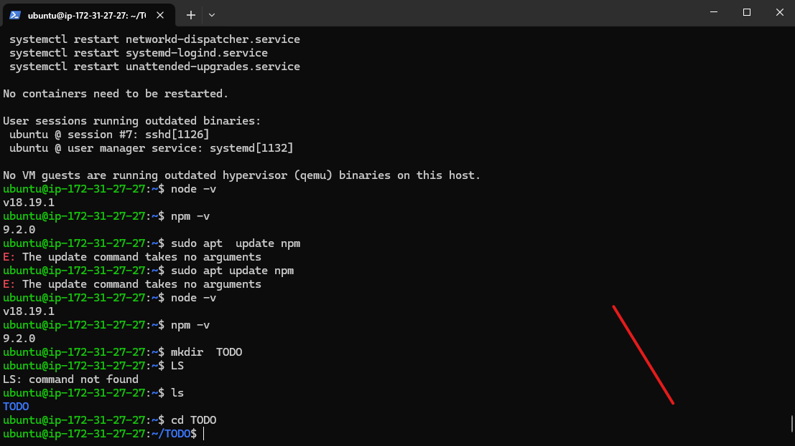
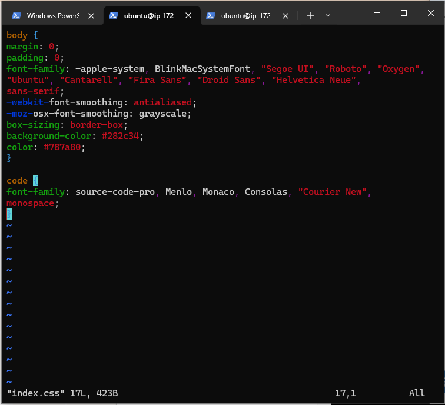

>    #   **THE MERN STACK**
___
**The Mern Stack combines the followings:** 
>  * **MONGO DATABASE**
>  * **EXPRESS JS**
>  * **REACT**
>  * **NODE JS**

___
___

>  The First thing to do is starting up an Instance on AWS

>   * **Security Group of the Instance allows**
>   *  **SSH ON PORT 22**
>   *  **HTTP ON PORT 80**
>   *  **HTTPS ON PORT 443**
>   *  **CUSTOM PORT 5000**
>   *  **CUSTOM PORT 3000**
>  

>  ## THE LINUX OS
>  **The Operating System in use is the **LINUX** used via a Window Terminal computer**

>  **This shows the SSH CONNECTION**

>  **I update the OS using
> * **sudo apt update**
> * **sudo apt upgrade**
___
___
> **THE NODE.JS AND NODE PACKAGE MANAGER(npm)**
> * A confirmation that NODE AND ITS MANAGER(NPM) is successfully installed
> 
> **Directory named TODO is created**
> 
> **npm init** **is used to initialiase the TODO FOLDER**

> * **PACKAGE.JSON is Present**
> #### EXPRESS.JS is installed using the ***npm install express***
> **index.js file is created empty and later opened using:**   ***vi index.js***

> **Tested using:** ***node index.js***

> **A new directory is created named ROUTES**
> **I change into the Directory then created a file named API.JS and opened using vim editor and write in necessary codes**
> * **mkdir Routes**
> * **cd Routes**
> * **touch api.js**
> * **vi api.js**
> 
##### I created a directory named ***MODELS*** and also install **mongoose** using:
* *mkdir models*
* *npm install mongoose*

within the model directory i created a file named it **todo.js** open the file and write in some codes

>> ***const mongoose = require('mongoose');
const Schema = mongoose.Schema;***

>> ***//create schema for todo
const TodoSchema = new Schema({
action: {
type: String,
required: [true, 'The todo text field is required']
}
})***

>> ***//create model for todo
const Todo = mongoose.model('todo', TodoSchema);***

>> ***module.exports = Todo;****

#### I modify the existing code in api.js to allow functionality

>> ***const express = require ('express');
const router = express.Router();
const Todo = require('../models/todo');***

>> **router.get('/todos', (req, res, next) => {***

 >> **//this will return all the data, exposing only the id and action field to the client
Todo.find({}, 'action')
.then(data => res.json(data))
.catch(next)
});***

 >> ***router.post('/todos', (req, res, next) => {
if(req.body.action){
Todo.create(req.body)
.then(data => res.json(data))
.catch(next)
}else {
res.json({
error: "The input field is empty"
})
}
});***

>> ***router.delete('/todos/:id', (req, res, next) => {
Todo.findOneAndDelete({"_id": req.params.id})
.then(data => res.json(data))
.catch(next)
})***

>> ***module.exports = router;***

> ## THE MONGODB
> **I registered via this link https://www.mongodb.com/products/try-free/platform/atlas-signup-from-mlab**

followed the prompt, later I created a cluster and a database and user
I allowed access from anywhere 

I process my database connection 

then created an .env file through which i connected DATABASE

I successfully connected my DATABASE

>#### **I downloaded a  postman  api**
I run an api post request 

and later run a get request
 they both show successfully
___
___ 
###  **THE FRONT END**
In the same root directory as My backend code, which is the Todo directory, I run:
 >> ***npx create-react-app client***; to create my front end app and a folder named **client** where all front end blocks of codes are

In  the Todo directory, I install legacy-peer-deps. it solves dependency tree conflict using:

>> * **npm install legacy-peer-deps**

In  the Todo directory, I Install concurrently. It is used to run more than one command simultaneously from the same terminal window. I use:
>> * **npm install concurrently --save-dev**

In the Todo directory, I Install nodemon. It is used to run and monitor the server. If there is any change in the server code, nodemon will restart it automatically and load the new changes. I use:
>> * **npm install nodemon --save-dev**

**In Todo folder I open the package.json file using vim package.json and fill it with this.**

**I  change directory into the client folder and open the package.json file to add:**
>> * "proxy": "http://localhost:5000" **so the application can run on localhost** 

**Then I changed directory into **client** and later to sub-directory named **src** where I created a directory named **components** and changed directory into it**
**Within I created files named:
> * Input.js
> * ListTodo.js
> * Todo.js

**I opened the Input.js via vim and paste code and confirmation**

**I confirmed that of ListTodo.js also:**

**I also confirmed the Todo.js file**

**Changing directory into src folder, already created and opened the ***App.js****  and fill it with codes. this is about front end design**

**I did the same for the **App.css** and fill in the codes**

**The last blocks of code**

**I run the command to bring up my built Application**
>> * npm run dev
**IT WORKS**  